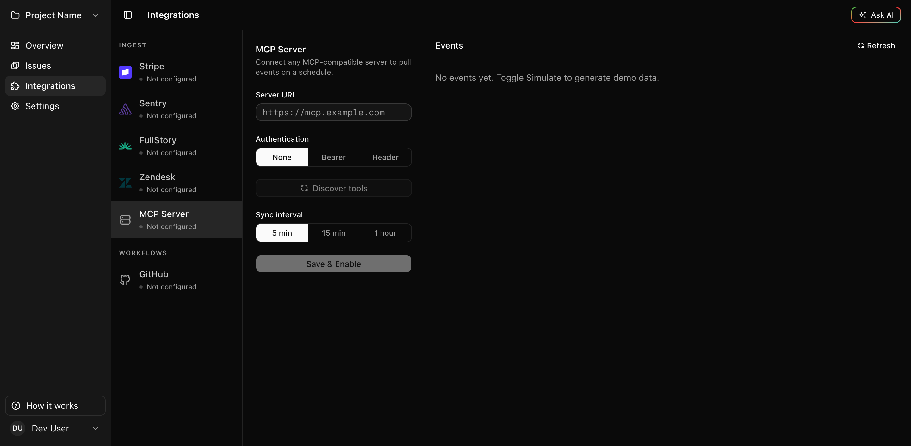

# Autopilot

Your AI product manager — pulls signals from Stripe, Sentry, FullStory and Zendesk, groups them by root cause, and tells you what to fix first.



## The problem

Product and engineering teams live across four tools — Stripe for revenue, Sentry for errors, FullStory for UX friction, Zendesk for support. Each fires its own alerts. Nobody connects them. The result: hours spent triaging noise while the real issues — the ones that are actually costing you money or users — stay buried across tabs.

Autopilot acts as a product manager that never sleeps: it reads every signal, links related ones across tools, ranks them by business impact, and hands you a clear "fix this next."

## What it does

- **Ingests events via webhook** from Stripe, Sentry, FullStory, and Zendesk — or connects any **MCP-compatible server** to pull events on a schedule (no public webhook URL required)
- **Proactively scouts for problems**, not just reactive ingestion — a scout calls an MCP tool on a schedule and only surfaces an issue when an LLM decides the result is a genuine finding against an objective you write
- **Clusters events by root cause**, not by source — a Stripe payment failure, a Sentry exception, and a FullStory rage-click from the same checkout flow become one issue, not three alerts
- **Scores every issue by business impact** — revenue at risk, frequency, and UX friction signals, weighted however you choose
- **Explains root cause and recommends a fix** — see affected users, cross-source signal breakdown, and a suggested next step
- **Files GitHub issues** — connect a repo and send any issue to your tracker, pre-written with full context
- **Fixes with a coding agent** — trigger Claude Code, OpenAI Codex, or Gemini Code Assist on a filed issue with one click, and see the resulting PR linked back automatically
- **Ask AI** — chat with the data to answer questions like "what's causing the most churn?" or "which users are affected by the checkout bug?"
- **Every pipeline stage is independently addressable** — outbound webhooks let third parties react to a stage transition (cluster created, scored, issue filed, fix requested, PR linked, resolved) without polling, and a custom scoring webhook can replace the internal prioritization formula entirely

## Stack

| Layer | Technology |
|---|---|
| Backend | FastAPI, SQLAlchemy 2.0, Alembic, PostgreSQL + pgvector |
| Frontend | Next.js 16, React 19, TypeScript, Tailwind CSS v4 |
| Auth | WorkOS |
| AI | Bring your own model (any OpenAI-compatible endpoint) — OpenAI is the zero-config default, Gemini an optional failure fallback |
| Deployment | Docker Compose |

## Self-hosting

### Prerequisites

- Docker and Docker Compose
- A [WorkOS](https://workos.com) account (free tier works — used for auth) **or** use `SKIP_AUTH=true` to skip auth entirely (see below)
- A model for clustering, scoring, embeddings, and Ask AI — **any** OpenAI-compatible endpoint works (LM Studio, Ollama, vLLM, OpenRouter, ...), or an OpenAI API key as the zero-config default. See **AI model configuration** below.

### Quickest start — no WorkOS account needed

Set `SKIP_AUTH=true` in your `.env` to bypass authentication completely. A "Dev User" is created automatically on first request — no WorkOS signup, no session keys to generate.

```bash
cp .env.example .env
# Uncomment SKIP_AUTH=true in .env
# Add an OPENAI_API_KEY, or point AI_BASE_URL at a local model (see below) — either works
docker compose up
docker compose exec backend alembic upgrade head
# Visit http://localhost:3000
```

> **Never use `SKIP_AUTH=true` in production.** All requests run as the same shared user with no access control.

### Full setup with WorkOS auth

### 1. Configure environment

```bash
cp .env.example .env
```

Edit `.env` and fill in:

| Variable | Where to get it |
|---|---|
| `WORKOS_API_KEY` | WorkOS dashboard → API Keys |
| `WORKOS_CLIENT_ID` | WorkOS dashboard → Applications |
| `WORKOS_COOKIE_PASSWORD` | Generate: `openssl rand -hex 32` |
| `SESSION_SECRET_KEY` | Generate: `openssl rand -hex 32` |
| `ENCRYPTION_KEY` | Generate: `python -c "from cryptography.fernet import Fernet; print(Fernet.generate_key().decode())"` |
| `OPENAI_API_KEY` | [platform.openai.com](https://platform.openai.com) |

WorkOS setup:
1. Create an application in the WorkOS dashboard
2. Set the redirect URI to `http://localhost:8000/api/auth/callback`
3. Enable the "AuthKit" sign-in method

### 2. Start services

```bash
docker compose up
```

### 3. Run migrations (first run only)

```bash
docker compose exec backend alembic upgrade head
```

### 4. Open the app

Visit `http://localhost:3000`

## AI model configuration

Autopilot is bring-your-own-model. `AI_BASE_URL` points at **any OpenAI-compatible endpoint** — LM Studio, Ollama, vLLM, OpenRouter, a hosted inference provider, whatever you already run — and is used for clustering, scoring, root-cause synthesis, and Ask AI. This is the same code path as production, not a Simulate-only shortcut, so you can run the entire pipeline on infrastructure you control.

```env
# Ollama example — pull a model first: ollama pull llama3.1
AI_BASE_URL=http://host.docker.internal:11434/v1
AI_MODEL=llama3.1

# LM Studio example
# AI_BASE_URL=http://host.docker.internal:1234/v1
# AI_MODEL=your-model-name-from-lm-studio

# AI_API_KEY is optional — most local servers ignore it, some hosted
# OpenAI-compatible providers (e.g. OpenRouter) require a real key
# AI_API_KEY=
```

If `AI_BASE_URL` is unset, Autopilot falls back to `OPENAI_API_KEY` — this is the zero-config default so the app works out of the box, not a hard requirement:

```env
OPENAI_API_KEY=sk-...
```

A Gemini key can additionally be set as a **failure fallback** — used only when the primary call (local model or OpenAI) errors out, e.g. rate limits or an outage. It is never the primary path:

```env
GEMINI_API_KEY=AIza...
GEMINI_MODEL=gemini-2.0-flash   # optional, this is the default
```

### Embeddings

Clustering uses vector embeddings for similarity search (pgvector). By default this calls OpenAI's `text-embedding-3-small` (1536 dimensions) if `OPENAI_API_KEY` is set, or the same `AI_BASE_URL` endpoint if one is configured and it serves an embeddings model. To use a different embedding model:

```env
AI_EMBEDDING_MODEL=nomic-embed-text   # or whatever your endpoint serves
AI_EMBEDDING_DIMS=768                 # must match that model's output dimension
```

`AI_EMBEDDING_DIMS` sizes the database's vector column (`alembic/versions/0018_configurable_embedding_dims.py` reads it at migration time), so set it **before** running `alembic upgrade head` on a fresh database. If you change it after the fact on an existing database, you'll need a follow-up migration or manual `ALTER TABLE ... ALTER COLUMN embedding TYPE vector(N)` — changing embedding dimension always invalidates previously-stored embeddings, since they're no longer comparable to new ones. Without any embedding model configured, clustering still works — it falls through to the LLM-only clustering path, just with more model calls.

## MCP Server integration (optional)

Connect any MCP-compatible server (Stripe Agent Toolkit, Datadog, custom internal tools) and Autopilot will pull events from it on a schedule — no public webhook URL required, works fully locally.

In the app: **Integrations → MCP Server**

1. Enter the server URL (Streamable HTTP transport — hosted MCP servers work directly; local servers must be reachable from the Docker network via `host.docker.internal` or a shared network)
2. Set authentication (None, Bearer token, or custom header)
3. Click **Discover tools** to fetch the available tool list
4. Select which tools to poll and set the sync interval (5 min / 15 min / 1 hour)
5. Save — Autopilot pulls on schedule and deduplicates results automatically

### Scouts — proactive checks (optional)

Regular sync above mirrors every selected tool's result into an event, unconditionally, on a shared schedule. A **scout** is different: it calls one tool with fixed arguments on its own schedule, and only creates an issue when an LLM decides the result is a genuine finding against an objective you write — most runs should produce nothing. This is proactive detection layered on top of a connected MCP server, not a replacement for plain sync.

In the app: **Integrations → MCP Server**, once a server is connected, under **Scouts**:

1. Click **Add scout**
2. Name it, pick (or type) the tool to call, and optionally set fixed arguments as JSON
3. Write an objective in plain language — e.g. *"Flag it if the error rate is meaningfully above normal for this time of day"*
4. Set a check interval (5 min / 15 min / 1 hour)
5. Use **Run now** any time to test it immediately and see whether it found something

Every scout run is evaluated against its objective by the same AI model configured above (**AI model configuration**) — no cloud dependency beyond whatever you already configured there. A scout that finds something creates a normal event (`source: scout`) that flows through the same clustering, scoring, and prioritization pipeline as everything else; a scout that finds nothing does nothing, so scouts don't add noise even running every 5 minutes.

## GitHub integration (optional)

Autopilot can file GitHub issues automatically when a problem cluster exceeds your priority threshold.

1. [Register a GitHub App](https://github.com/settings/apps/new)
   - Callback URL: `{FRONTEND_URL}/github/callback`
   - Webhook URL: `{BACKEND_URL}/api/webhooks/github-app`
   - Permissions: Issues → Read & Write, Pull requests → Read-only, Metadata → Read
   - Events: Issues, Pull request, Installation
2. Add to `.env`:
   ```env
   GITHUB_APP_ID=your_app_id
   GITHUB_APP_SLUG=your-app-slug
   GITHUB_APP_PRIVATE_KEY=   # PEM contents, newlines as \n
   GITHUB_APP_WEBHOOK_SECRET=your_webhook_secret
   NEXT_PUBLIC_GITHUB_APP_SLUG=your-app-slug
   ```
3. In the app: go to **Integrations → GitHub** → Install GitHub App → select a repo

> If you registered the GitHub App before the **Pull requests** permission/event existed, update the App's permissions on GitHub and accept the new grant on each installation — otherwise PR-linking (see below) won't fire.

To test webhooks locally, use a tunnel:
```bash
cloudflared tunnel --url http://localhost:8000
```

## Fix with a coding agent (optional)

Once a GitHub issue is filed for a cluster, Autopilot can trigger a fix from Claude Code, OpenAI Codex, or Gemini Code Assist directly from the issue's detail panel — closing the loop from *identified* to *fixed* without leaving the app.

This doesn't run any agent itself. Each provider is its own GitHub App/Action that you install separately on your repo and that watches for a trigger comment (e.g. `@claude`) on an issue; Autopilot just posts that comment and links back the PR the agent opens.

1. In the app: go to **Integrations → Coding Agents**
2. Toggle on the providers you have installed on your repo (Claude Code, OpenAI Codex, Gemini Code Assist) — see each provider's own setup guide linked in that panel
3. Optionally customize the trigger comment per provider — the defaults follow each vendor's documented convention, but exact syntax can vary by how a repo has it configured
4. On any cluster with a filed GitHub issue, click **Fix with…** and pick a provider

Not using Claude/Codex/Gemini? Click **Add custom agent** in the same panel — any coding agent that watches GitHub issue comments and opens a PR works, since Autopilot only needs its name and trigger phrase. No code change or update required to support a new vendor.

Autopilot doesn't verify the provider is actually installed on your repo — if nothing happens after triggering, double-check the provider's GitHub App/Action is set up and that its trigger phrase matches what Autopilot posted. Once the agent opens a PR that references the issue (e.g. `Fixes #123`), Autopilot links it back to the cluster and shows its state (open / merged / closed).

## Webhooks (optional)

Every pipeline stage — ingest, cluster, score, recommend, file issue, trigger fix — is independently addressable instead of being one closed flow. Outbound webhooks let a third party (a Slack notifier, a custom dashboard, an internal alerting tool) react to a stage transition without polling the REST API; a custom scoring plugin (below) lets a third party replace the scoring stage's logic entirely.

### Outbound events

1. In the app: go to **Integrations → Webhooks** → **Add webhook**
2. Enter a URL and pick which events you want:
   - `cluster.created` — a new cluster was formed
   - `cluster.scored` — a cluster's priority score was (re)computed
   - `cluster.issue_filed` — a GitHub issue was filed for a cluster (manual or Autopilot auto-file)
   - `cluster.fix_requested` — a "Fix with…" trigger comment was posted
   - `cluster.fix_pr_linked` — a fix PR was detected and linked back (open, merged, or closed)
   - `cluster.resolved` — a cluster's status changed to resolved
3. Copy the signing secret shown once at creation — you'll need it to verify deliveries

Each delivery is a `POST` with the raw event as the body and two headers: `X-Autopilot-Event: <event type>` and `X-Autopilot-Signature: sha256=<hex>`, an HMAC-SHA256 of the body using your subscription's secret. Verify it before trusting the payload:

```python
import hashlib, hmac

def verify(secret: str, body: bytes, signature_header: str) -> bool:
    expected = "sha256=" + hmac.new(secret.encode(), body, hashlib.sha256).hexdigest()
    return hmac.compare_digest(expected, signature_header)
```

Delivery is fire-and-forget and best-effort — a slow or dead endpoint never blocks or fails the pipeline stage that triggered it, and there's no retry queue. Use the **Send test event** button on a subscription to check it's reachable, and watch the "last delivery" status shown on each subscription for ongoing health.

### Custom scoring plugin

By default, priority score is `revenue_score × weight_revenue + frequency_score × weight_frequency + ux_score × weight_ux`, computed internally (**Settings → Prioritization**). To replace that with your own logic — e.g. factoring in ARR or account-tier data Autopilot doesn't have — set a scoring webhook URL in the same settings page. Autopilot POSTs the cluster's raw signal data (HMAC-signed, same scheme as above) and uses whatever your endpoint returns:

```json
{"revenue_score": 0.8, "frequency_score": 0.4, "ux_score": 0.2}
```

Autopilot still applies the project's configured weights to combine these three. To bypass the weights entirely, return `priority_score` directly instead:

```json
{"priority_score": 0.65}
```

On any failure — timeout, unreachable, malformed response — Autopilot falls back to the internal formula. A broken scoring plugin degrades gracefully; it never breaks clustering.

## Evaluating the product before connecting real integrations

Autopilot includes a **Simulate** mode so you can walk through the full product experience — clustering, scoring, root cause analysis, GitHub filing, Ask AI — without configuring a single webhook. It's an onboarding shortcut, not a production feature: once your real integrations are sending events, turn Simulate off.

1. Create a project
2. Go to **Integrations** → toggle **Simulate** on any source — AI-generated events start flowing immediately
3. Go to **Issues** to see clustering and scoring in action
4. Open any issue to see root cause, affected users, revenue impact, and recommended fix
5. Adjust scoring weights in **Settings → Severity**
6. When ready: configure a real integration and disable Simulate

## Project structure

```
autopilot/
├── backend/
│   ├── app/
│   │   ├── api/          # FastAPI route handlers
│   │   ├── models/       # SQLAlchemy models
│   │   ├── schemas/      # Pydantic schemas
│   │   └── services/     # AI, auth, webhooks, evaluation
│   ├── alembic/          # Database migrations
│   └── requirements.txt
└── frontend/
    ├── app/              # Next.js App Router pages
    ├── components/       # UI components
    └── lib/              # API client, hooks
```

## License

MIT
